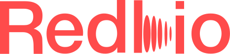

# project-template
Use this template for project's repository.

  

<h1 align="center">Redbio</h1>

  One-line description of the project

  🔗 <a href="https://www.eunbicho.me/redbio"><b>View detailed case study</b></a>

---

## 🧩 Overview
RedBio is an interactive learning system that leverages biosignals such as EEG and heart rate to adapt learning experiences in real time.

Rather than treating learning as a static process, the project explores how physiological data can be used to dynamically adjust engagement, stress levels, and focus.
The system aims to make learning more responsive to the learner’s condition, supporting sustained attention and more effective learning experiences.

---

## ❗ Problem
- Learning systems do not account for the learner’s real-time mental or emotional state
- Learners struggle to maintain focus without understanding when and why their attention drops
- Stress and cognitive overload often go unnoticed, negatively affecting learning efficiency
- As a result, learning becomes inconsistent and difficult to sustain over time

---

## 💡 Solution
- Integrate biosignal data (EEG, heart rate) to reflect the learner’s real-time state
- Provide immediate feedback to make changes in focus and stress visible
- Adapt learning interactions based on physiological responses to sustain engagement
- Enable learners to understand and regulate their own learning through a continuous feedback loop

---

## ✨ Key Features
- Real-time biosignal tracking with intuitive visualization of stress and focus
- Adaptive learning experience that responds to the learner’s physiological state
- Personalized feedback loop integrated into seamless UX/UI to support engagement

---

## 🗺️ Process

### Research
- Surveys
- Interviews
- Competitive Analysis

### Ideation
- Persona
- Journey map

### Design
- Interaction / UI decisions

---

## 🧠 Journey Map

  

---

## 🎨 Prototype UI

  
  

  
  

---

## 📊 Business Model (Optional)

  

---

## 🚀 Outcome
- What did you achieve?
- Impact / results / learning

---

## 🔍 Reflection
- What did you learn?
- What would you improve?
